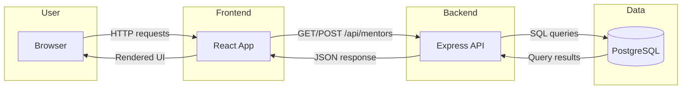

# Overcome Wellness App

A wellness and recovery support application that helps users navigate their journey through evidence-based curriculum, professional help, peer mentors, and community connection.

## App Summary

Overcome Wellness addresses the need for accessible, supportive resources during recovery and wellness journeys. Many individuals struggle to find trustworthy information, connect with qualified professionals, or feel understood by peers who have walked a similar path. This application provides a single place where users can access curated curriculum modules, browse licensed therapists and peer mentors, participate in community chat, and track their progress. The primary user is someone seeking support for behavioral change, addiction recovery, or relational healing. The product combines educational content, professional matching, peer support, and community features into one cohesive mobile-friendly web experience.

## Tech Stack

| Layer | Technologies |
|-------|--------------|
| **Frontend** | React 18, Vite, TypeScript, React Router, TanStack Query (React Query), shadcn/ui, Tailwind CSS, Framer Motion |
| **Backend** | Node.js, Express |
| **Database** | PostgreSQL 12+ |
| **Tooling** | ESLint, Vitest |
| **Authentication** | Not yet implemented |
| **External Services** | None |

## Architecture Diagram



**Data flow for Add Mentor (vertical slice):**
1. User clicks "Add Therapist/Mentor" button in the Mentors page.
2. Frontend opens a form dialog and sends `POST /api/mentors` with form data.
3. Backend receives the request and inserts a new row into the `mentors` table.
4. Backend returns the newly created mentor as JSON.
5. Frontend invalidates the mentors query and refetches, displaying the updated list.
6. After a page refresh, the new mentor persists because data comes from the database.

## Prerequisites

Before running the application, install and configure the following:

| Software | Purpose | Install |
|----------|---------|---------|
| **Node.js** (v18+) | Runtime for frontend and backend | [nodejs.org](https://nodejs.org/) or [nvm](https://github.com/nvm-sh/nvm#installing-and-updating) |
| **PostgreSQL** (12+) | Database | [postgresql.org/download](https://www.postgresql.org/download/) |
| **psql** | Command-line tool for running SQL scripts; included with PostgreSQL | Ensure PostgreSQL `bin` is in your system PATH |

**Verify installation:**

```bash
node --version   # v18.x or higher
npm --version    # 9.x or higher
psql --version   # PostgreSQL 12 or higher
```

## Installation and Setup

### 1. Clone the repository

```bash
git clone <YOUR_REPO_URL>
cd overcome-wellness-app-milestone-6
```

### 2. Create the database

Using `psql` or any PostgreSQL client, create the database:

```bash
psql -U postgres -c "CREATE DATABASE overcome_wellness;"
```

### 3. Run schema and seed scripts

From the project root (where the `db` folder is located):

```bash
psql -U postgres -d overcome_wellness -f db/schema.sql
psql -U postgres -d overcome_wellness -f db/seed.sql
```

On Windows, if `psql` is not in your PATH, use the full path, e.g.:

```bash
"C:\Program Files\PostgreSQL\16\bin\psql.exe" -U postgres -d overcome_wellness -f db/schema.sql
"C:\Program Files\PostgreSQL\16\bin\psql.exe" -U postgres -d overcome_wellness -f db/seed.sql
```

### 4. Configure environment variables

Copy the example env file in the server folder and adjust values if needed:

```bash
cp server/.env.example server/.env
```

Edit `server/.env` and set your PostgreSQL credentials (host, port, user, password, database). Default values:

- `PGHOST=localhost`
- `PGPORT=5432`
- `PGUSER=postgres`
- `PGPASSWORD=postgres`
- `PGDATABASE=overcome_wellness`

### 5. Install dependencies

**Backend:**

```bash
cd server
npm install
cd ..
```

**Frontend:**

```bash
cd overcome-wellness-app
npm install
cd ..
```

## Running the Application

You must run both the backend and frontend.

### Start the backend

```bash
cd server
npm run dev
```

The API runs at **http://localhost:3001**. Keep this terminal open.

### Start the frontend

In a new terminal:

```bash
cd overcome-wellness-app
npm run dev
```

The app runs at **http://localhost:8080**. Open this URL in your browser.

## Verifying the Vertical Slice

These steps confirm that the "Add Therapist/Mentor" button updates the database and reflects changes in the UI (including after refresh).

1. **Open the Mentors page**  
   Navigate to `http://localhost:8080/mentors`. You should see the mentors loaded from the database.

2. **Click "Add Therapist/Mentor"**  
   A dialog with a form should open.

3. **Fill out the form**  
   - Name: `Test Mentor`
   - Role: `Peer Mentor`
   - Specialty: `Test Specialty`
   - Bio: `This is a test bio for verification.`
   - Rating: `4.5`
   - Licensed Professional: unchecked (peer mentor)

4. **Submit the form**  
   Click "Add Mentor". The dialog should close and the new mentor should appear in the Peer Mentors section.

5. **Verify persistence**  
   Refresh the page (F5 or Ctrl+R). The new mentor should still appear in the list, confirming the data was saved to the database.

6. **Optional: Verify in the database**  
   Run:  
   `psql -U postgres -d overcome_wellness -c "SELECT id, name, role FROM mentors ORDER BY id;"`  
   You should see "Test Mentor" in the results.
